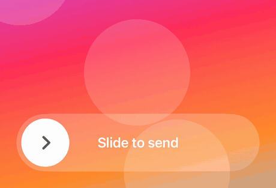

<p align="center">
  
</p>

<h1 align="center">SlideToConfirm</h1>

<p align="center">
  A slide-to-confirm control for SwiftUI, built for Liquid Glass.
</p>

<p align="center">
  <a href="https://github.com/o-danylenko/Slide-To-Button/actions/workflows/ci.yml"></a>
  <a href="https://o-danylenko.github.io/Slide-To-Button/documentation/slidetoconfirm/"></a>
  <a href="https://swiftpackageindex.com/o-danylenko/Slide-To-Button"></a>
  <a href="https://swiftpackageindex.com/o-danylenko/Slide-To-Button"></a>
  
</p>

A tap is one event. A slide is a hundred, in one direction, held for most of a second — so a pocket or
a stray thumb cannot produce one. That makes it the right gesture in front of anything you cannot
undo: sending money, wiping a device, arming an alarm.

SlideToConfirm gives you:

- **A trail locked to the knob.** Both interpolate from one value, so a fast flick cannot separate
  them.
- **A latch you own.** `isConfirmed` is a binding, so a server event can confirm the control too, and
  you decide when to re-arm it.
- **Progress in the knob.** Its contents are a closure of the current state, so an in-flight spinner
  needs no second flag.
- **Liquid Glass, with a fallback.** Real glass on iOS 26, a translucent fill below it, and no
  availability check in your code.
- **Ripples.** An optional Metal effect that follows the drag.

## Installation

```swift
.package(url: "https://github.com/o-danylenko/Slide-To-Button", from: "1.0.0")
```

Then add `SlideToConfirm` to your target's dependencies.

**Requirements:** iOS 17 or later. Xcode 26 or later to build, since the Liquid Glass path needs the
iOS 26 SDK. iOS only. No dependencies.

## Usage

```swift
import SlideToConfirm

@State private var isSending = false

SlideToConfirm(isConfirmed: $isSending) {
    send()
} label: {
    Text("Slide to Confirm").font(.headline)
}
```

A binding holding whether the control has confirmed, an action, and a label.

The knob must travel **80%** of the track to confirm — `SlideState.threshold`. Released short of it,
it springs back and the action does not fire. Past it, the knob completes the journey on its own and
the action fires when that animation lands. The gesture takes priority over an enclosing `ScrollView`
or sheet, so the control works in a scrolling list.

The control sizes itself to its label, so Dynamic Type and multi-line copy grow it instead of being
clipped. `disabled(_:)` dims it and drops the gesture.

## The confirm latch

The control never clears `isConfirmed` itself. Set it to `true` from anywhere — a server event, a
push, a restored session — and the knob parks at the trailing edge without a gesture. Set it back to
`false` to re-arm:

```swift
withAnimation(.slideSnapBack) { isSending = false }
```

If the action can fail, clear the latch on the error path as well as the success path.

## Progress in the knob

The knob's contents come from a closure receiving the current `SlideState` — `.idle`,
`.sliding(progress:)`, or `.confirmed`:

```swift
SlideToConfirm(isConfirmed: $isSending) { send() } label: {
    Text("Slide to Confirm")
} handleContent: { state in
    if state == .confirmed {
        ProgressView().tint(.white)
    } else {
        SlideChevron()          // the default mark
    }
}
```

`state.progress` is available too, so the mark can turn or fade as the finger moves rather than only
swapping at the ends.

## Styles

<p align="center">
  
</p>

```swift
.slideStyle(.tinted(.green))     // untinted glass, green knob — the default, as .automatic
.slideStyle(.monochrome(.red))   // glass washed with the tint at half strength
.slideStyle(.clear(.mint))       // clear glass: most transparent, wants a contrasty backdrop
.slideStyle(.solid(.orange))     // flat fill, no glass on any OS version
```

Style travels in the environment, so setting it on a container reaches every control inside.

Any `ShapeStyle` works as the capsule's surface:

```swift
.slideStyle(.solid(.white, surface: LinearGradient(
    colors: [.purple, .blue], startPoint: .leading, endPoint: .trailing
)))
```

For full control, build a `SlideStyle` directly. `Surface.glass(tint:fallback:)` is where you set what
the capsule looks like below iOS 26:

```swift
.slideStyle(
    SlideStyle(
        surface: .glass(tint: .indigo.opacity(0.4), fallback: AnyShapeStyle(.indigo.opacity(0.15))),
        tint: .indigo,
        inset: 5
    )
)
```

`.solid(…)` returns a `SlideStyle.Solid`, since that is what carries the effects below. `slideStyle(_:)`
takes either type; to store one as a `SlideStyle`, use `.solid(.blue).slideStyle`.

## Size

<p align="center">
  
</p>

`height` sets the capsule's height, `inset` the gap between the knob and its edge. Both scale with
Dynamic Type.

```swift
.slideStyle(.tinted(.blue, inset: 3, height: 40))
.slideStyle(.monochrome(.purple, height: nil))
```

Pass `height: nil` where the label must grow — multi-line copy, or the accessibility text sizes.

## Effects

<p align="center">
  
</p>

The knob can leave a wake behind it, as though dragged across water:

```swift
SlideToConfirm(isConfirmed: $isSending) { send() } label: {
    Text("Slide to send")
}
.slideStyle(.solid(.white, surface: Color.white.opacity(0.22)).stillEffect)
```

Three presets, cheapest first: `stillEffect`, `waterEffect`, `splashEffect`. Ripple strength follows
the knob's speed, so a slow drag leaves a faint trail and a flick a strong one.

For your own parameters, `rippleEffect(_:)` takes a `SlideWake`:

```swift
.slideStyle(
    .solid(.white, surface: Color.white.opacity(0.22))
        .rippleEffect(SlideWake(amplitude: 10, speed: 200, wavelength: 30, damping: 3))
)
```

Effects are available on `.solid(…)` styles only — glass cannot be distorted, so
`.tinted(.blue).stillEffect` does not compile. Use a **translucent** surface: ripples bend what is
behind the capsule, so over an opaque fill there is nothing to see.

They hold the display's frame rate on an iPhone 12 or later, render only while ripples are alive, and
cost nothing on a style that does not ask for them. Reduce Motion turns them off.

## Accessibility

- **VoiceOver** substitutes a plain button, since a drag cannot be performed through it.
- **Reduce Motion** confirms immediately rather than springing the knob, and suppresses ripples.
- **Dynamic Type** scales the height, the inset and the label together.
- **Haptics** fire at both ends of the gesture.

## API

| Symbol | What it is |
| --- | --- |
| `SlideToConfirm` | the control |
| `SlideState` | `.idle` / `.sliding(progress:)` / `.confirmed`, plus `progress` and `threshold` |
| `SlideStyle` | surface, tint, inset, height — carried in the environment |
| `SlideStyle.Solid` | what `.solid(…)` returns; carries the effects |
| `SlideWake` | ripple parameters |
| `SlideChevron` | the default knob mark |
| `Animation.slideSnapBack` | returns the knob to rest; wrap a re-arm in this |
| `Animation.slideConfirm` | carries the knob home past the threshold |
| `Animation.slideAppearance` | scales the knob as a slide begins and ends |

Full reference: [o-danylenko.github.io/Slide-To-Button](https://o-danylenko.github.io/Slide-To-Button/documentation/slidetoconfirm/).

## Example app

`Example.xcodeproj` shows each style over an animated backdrop, the ripple effect, and a
device-pairing screen where the confirm arrives from a simulated server rather than from the gesture.

## Tests

`swift test` runs on the host — no simulator or device needed.

## License

MIT. See [LICENSE](LICENSE).
