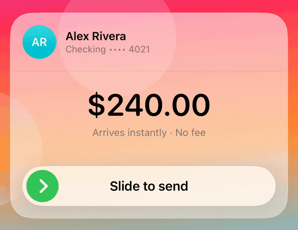
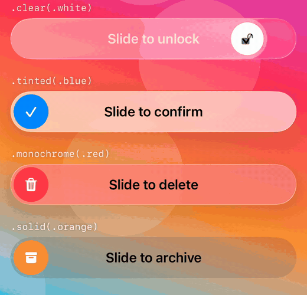
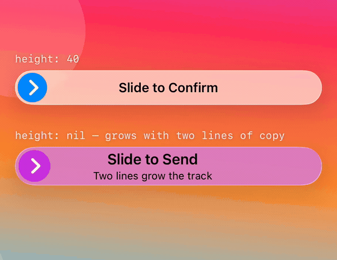

# SlideToConfirm

A slide-to-confirm control for SwiftUI. Liquid Glass on iOS 26, a translucent fill below it.

  



A tap is one event; a slide is a hundred. That makes a slide the right gesture for anything
irreversible — sending money, deleting a record, arming a device — because a pocket or a stray thumb
cannot produce one.

## Installation

```swift
.package(url: "https://github.com/<you>/SlideToConfirm", from: "1.0.0")
```

Requires iOS 17. Liquid Glass activates on iOS 26 and later.

## Usage

```swift
import SlideToConfirm

@State private var isSending = false

SlideToConfirm(isConfirmed: $isSending) {
    send()
} label: {
    Text("Slide to Confirm").font(.headline)
}
```

The control sizes itself to its label, so Dynamic Type and multi-line copy grow it rather than being
clipped by it. `disabled(_:)` dims it and drops the gesture, as on any control.

### The caller owns the confirm latch

`isConfirmed` is a binding rather than internal state, because the gesture is not the only thing
that can confirm — a server event or a push can latch it too, and only the caller knows when the
work behind it has finished. Set it back to `false` to re-arm:

```swift
withAnimation(.slideSnapBack) { isSending = false }
```

If the action can fail, clear the latch on the error path as well as the success path. A control
that never re-arms is the usual bug here.

### Progress in the knob

The knob's contents are a function of the state, so an in-flight spinner is a switch rather than a
second flag to keep in sync:

```swift
SlideToConfirm(isConfirmed: $isSending) { send() } label: {
    Text("Slide to Confirm")
} handleContent: { state in
    if state == .confirmed {
        ProgressView().tint(.white)
    } else {
        SlideChevron()
    }
}
```

### Styling



```swift
.slideStyle(.tinted(.green))                    // untinted glass, green knob
.slideStyle(.monochrome(.red))                  // glass tinted at half strength
.slideStyle(.clear(.mint))                      // the clear glass variant
.slideStyle(.solid(.orange))                    // no glass on any version
.slideStyle(.tinted(.blue, inset: 3, height: 40))
```

Style is carried in the environment, so setting it on a container reaches every control inside.

The capsule is the glass and the knob is solid, deliberately: glass is a lens, so it needs area to
refract through and something behind it to bend. A knob-sized pane has neither. The knob stays
solid so it remains legible against whatever the capsule is refracting.

### Size

`height` defaults to a normal control height. Pass `nil` where the label must be free to grow —
multi-line copy, or large Dynamic Type sizes, which a fixed height cannot expand to fit.



```swift
.slideStyle(.tinted(.blue, inset: 3, height: 40))
.slideStyle(.monochrome(.purple, height: nil))
```

## Design

Four layers, each with one job:

| Type | Responsibility | Framework |
| --- | --- | --- |
| `SlideState` | the input state machine | none |
| `SlideGeometry` | size and translation to progress | CoreGraphics |
| `SlideToConfirm` | the gesture and its storage | SwiftUI |
| `SlideTrack` | paint | SwiftUI |

`SlideTrack` has no `@State`, no `@GestureState`, and no gesture — so no change to how the control
looks can regress how it drags. That guarantee comes from the shape of the type.

`SlideState` is a total transition where `confirmed` absorbs, so the precedence of a latched confirm
over a live finger is stated once rather than re-derived at each read. `SlideFill` carries progress
as `animatableData`, which is what keeps the trail locked to the knob: both are readings of one
interpolated value, so neither can lag the other.

## Documentation

```sh
xcodebuild docbuild -scheme SlideToConfirm -destination 'platform=iOS Simulator,name=iPhone 17 Pro'
```

Or open the package in Xcode and choose Product → Build Documentation.

## Tests

```sh
swift test
```

The state machine and the geometry are pure values, so the suites run on the host without a
simulator.

## Example

`Example.xcodeproj` is a gallery of the built-in styles over an animated backdrop. The backdrop is
not decoration: over a flat background, glass has nothing to refract and reads as flat colour.
Dragging a knob across a moving field is the only way to see the material behave like a lens.

## License

MIT. See [LICENSE](LICENSE).
